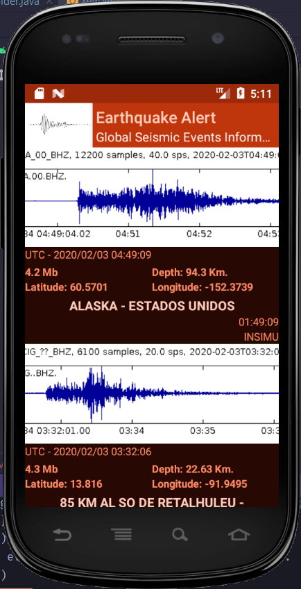

# Alert-API
Alert-API its an Android applications that allows the user to saw seismic event either from Chile or the rest of the world.

## Description (In progress ...)
Using the "Chile Alerta" external API, we call all kind of seismic across the world.

## Screenshot

### Features
Night Mode 🌗

### Restrictions
Only its allowed one consult per minutes.
Min SDK Version: 24 (Target 29).

### Libraries
SLF4J
RecyclerView
SwipeRefreshLayout
Retrofit
Gson
Toasty
Fresco
Okhttp
Lifecycle
ACRA

### Designer
Ariel Vejar

### Installation
Use the [Android Studio Canary](https://developer.android.com/studio/preview) to import the project.

### License
[Apache-2.0](https://choosealicense.com/licenses/apache-2.0/)